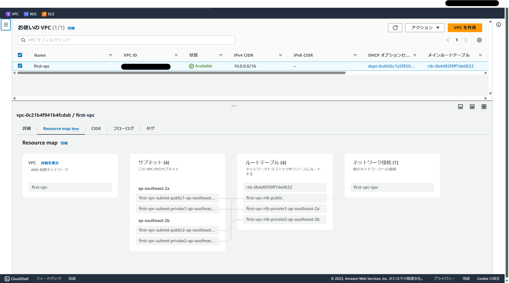
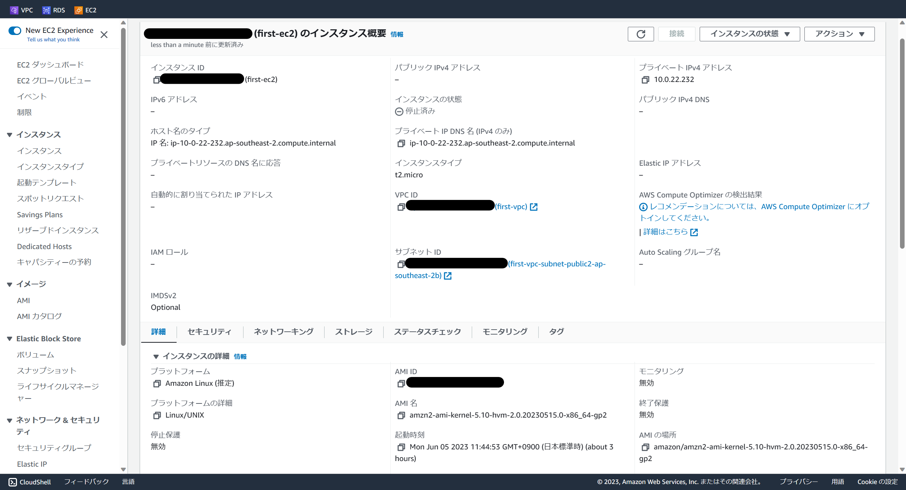
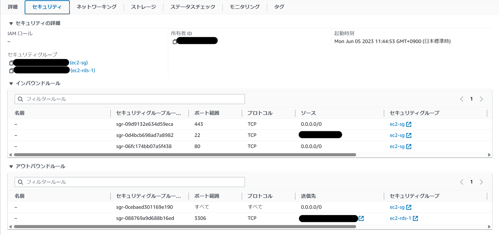
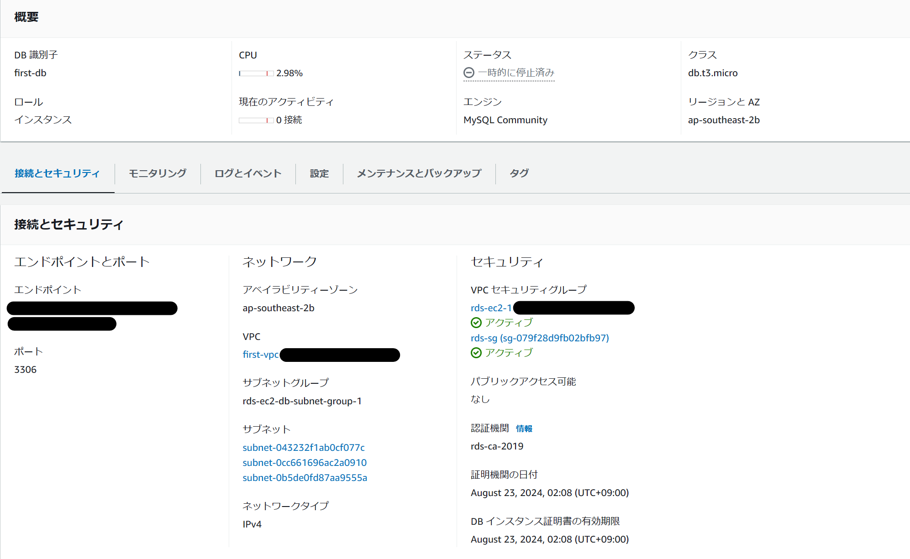
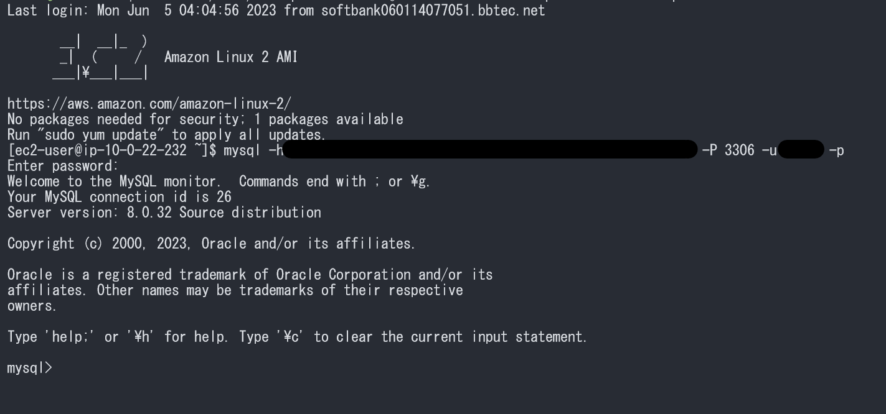

# AWS第4回まとめ

## 各セキュリティグループ
### EC2用
- SSH(port:22)を許可
- Source: マイIPを指定(このデバイスのIPアドレス)
- HTTP(port:80)を許可
- HTTPS(port:443)を許可
- Source: 全てのIPアドレス(0.0.0.0/0)を許可


### RDS用
- 任意のDBポートを許可
- Type: MySQL/Aurora(port:3306)
- Protocol: TCP
- Source: EC2のセキュリティグループIDを指定


## VPC設定



- **サブネット(パブリック/プライベート)**  
VPCをより小さなネットワークに分割するためのセグメント。  
サブネット内にAWSリソースを適切に配置する。
- **ルートテーブル**  
VPC内のネットワークトラフィックの転送を制御する。  
送信先のネットワーク（宛先）と転送先間の関連を定義する。
- **IGW(Internet Gateway)**  
VPC内のプライベートなネットワークとパブリックなインターネットとの接続を可能にするサービス  
- **Region**  
実際にデータセンターが配置されている地理的な領域。  
`エリア+数字`で表現される(東京: ap-northeast-1)
- **AZ(Availability Zone)**  
リージョン内の複数の物理的なデータセンターで構成されたセグメント。  
`リージョン名+アルファベット1文字`で表現される(例: ap-northeast-1a, ap-northeast-1c)

## EC2インスタンス(仮想コンピューティング環境)新規作成




- **AMI(Amazon Machine Image)**  
設定: AMazon Linux 2  
インスタンスの起動に必要なソフトウェア設定(オペレーティングシステム、アプリケーションサーバー、アプリケーション)を含むテンプレート。
- **インスタンスタイプ**  
設定: t2.micro(無料利用枠)  
このEC2インスタンスに必要なインスタンスのサイズや性能を選択する
- **パブリックIPの自動割り当て**  
デフォルトでは無効になっている
  
## RDS(MySQL)新規作成


- **データベースエンジン**  
設定: MySQL
- デプロイオプション(可用性と耐久性: Multi-AZ)  
無料利用枠では設定できない。
- **接続**  
1. EC2コンピューティングリソースに自動接続
2. サブネットグループを設定
3. セキュリティグループを設定

## EC2ログインからMySQLログインまで


1. EC2にログイン  
`ssh -i location_of_pem_file ec2-user@ec2-instance-public-dns-name`
2. EC2 インスタンスを更新し最新のバグ修正とセキュリティ更新を入手  
`sudo yum update -y`
3. 念のためMariaDBをアンインストール  
`sudo yum remove mariadb-libs`
4. MySQL公式のyumリポジトリを追加  
`sudo yum install https://dev.mysql.com/get/mysql80-community-release-el7-1.noarch.rpm -y`
5. インストールするバージョンの有効化  
＜MySQL8.0 を使用する場合＞  
`sudo yum-config-manager –enable mysql80-community`  
＜MySQL5.7 を使用する場合＞  
`sudo yum-config-manager –disable mysql80-community`  
`sudo yum-config-manager –enable mysql57-community`  
6. MySQLをインストール  
`sudo yum install mysql-community-server` 
7. バージョン確認  
`mysql --version`    
8. MySQLにログイン
`mysql -h <RDSのエンドポイント> -P <ポート番号> -u <マスターユーザー名> -p
`

## トラブルシューティング
- GPGキーエラー  
```
Failing package is: mysql-community-libs-5.7.37-1.el7.x86_64
GPG Keys are configured as: file:///etc/pki/rpm-gpg/RPM-GPG-KEY-mysql
```  
yumではパッケージが改ざんされているか検証するためにGPGキーを利用していることがあり、  
このGPGキーには有効期限が設定されている関係で一定期間が経つと検証が行えなくなりインストールが停止してしまう。

- 解決策  
**新しいGPGキーをインストールすることで解決できました**  
`sudo rpm --import https://repo.mysql.com/RPM-GPG-KEY-mysql-2022`  

## 学び
- インフラ領域は想像以上に奥が深い  
- SSHキーを`~/.ssh/`に移動させた場合の相対パス  
`ssh -i "/home/username/.ssh/example.pem"`  
`ssh -i "~/.ssh/example.pem `
- LinuxからWindowsのファイルシステム配下にあるファイルのパーミッションは変更できない  
**つまり`chmod 400 example.pem`(読取のみ許可)がきかない**  
なのでLinux上で作業することにした

## 参考
- [[MySQL] アップデート時にGPGキーのエラーで停止してしまう場合](https://blog.katsubemakito.net/mysql/mysql-update-error-g)
- [EC2インスタンスにパブリックIPが割り当てられない時に確認すること](https://soypocket.com/it/aws-ec2-public-ip-setting/)
- [Amazon Linux 2 で MySQL を使用する](https://www.acrovision.jp/service/aws/?p=736)
- [RDS for MySQLを構築しEC2からアクセスしてみる](https://dev.classmethod.jp/articles/sales-rds-ec2-session/)